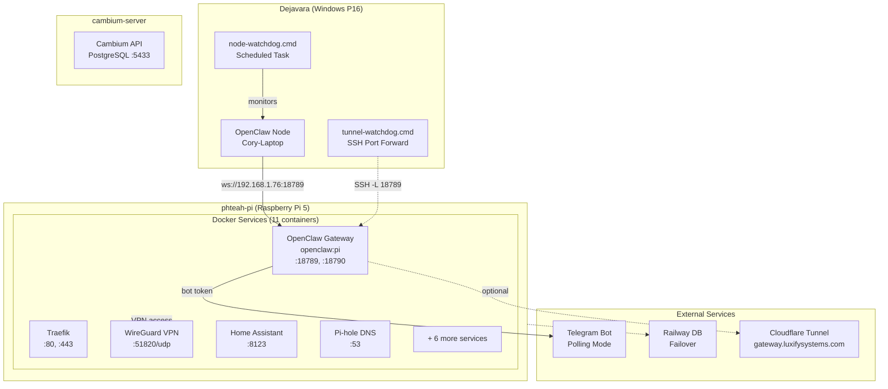

# OpenClaw Infrastructure Audit

**Date:** 2026-02-13
**Auditor:** Claude Code
**Scope:** phteah-pi (Raspberry Pi 5) ↔ Dejavara (Windows P16)

## Architecture Diagram



## What's Working

| Component | Status | Details |
|-----------|--------|---------|
| **OpenClaw Gateway** | ✅ Healthy | Container up 3+ hours, healthcheck passing |
| **OpenClaw Node** | ✅ Running | Windows node paired, last activity ~3h ago |
| **SSH Connectivity** | ✅ Working | phteah-pi accessible via key auth |
| **Docker Infrastructure** | ✅ Stable | 11/11 containers running, no restarts |
| **System Resources** | ✅ Excellent | 48.8°C, 34% RAM, 16% disk |
| **Watchdog Recovery** | ✅ Functional | Auto-restarts with 15s delay |
| **Device Pairing** | ✅ Active | 2 devices paired (gateway + webchat) |
| **Telegram Bot** | ✅ Configured | Bot token set, allowlist enabled |
| **WireGuard VPN** | ✅ Available | wg-easy running on :51820 |

## What's Broken/Unstable

| Issue | Severity | Description |
|-------|----------|-------------|
| **HTTPS Secure Context** | 🟡 Medium | Control UI WebSocket connections fail with code 1008 "control ui requires HTTPS or localhost". Browser crypto.subtle requires secure context. |
| **Node Connection Errors** | 🟡 Medium | Logs show "closed before connect" (code 4008) from Feb 14 03:16-04:50 |
| **Agent Timeout** | 🟡 Low | anthropic:manual profile hit rate limit at 06:05 UTC, fallback to anthropic:dejavara worked |
| **Empty ANTHROPIC_API_KEY** | 🟢 Non-issue | docker-compose has empty env var, but profiles in openclaw.json have keys configured |
| **Syncthing Missing** | 🟢 Optional | Not configured between systems (using cloud storage instead) |

## Critical Configuration Files

### phteah-pi (Gateway)
- **Docker Compose:** `/home/dejavara/homeserver/docker-compose.yml`
- **OpenClaw Config:** `/mnt/data/docker/openclaw/config/openclaw.json`
- **Device Pairing:** `/mnt/data/docker/openclaw/config/devices/*.json`
- **Workspace:** `/mnt/data/docker/openclaw/workspace/` (83MB)

### Dejavara (Node)
- **Node Config:** `~/.openclaw/node.json`
- **Watchdog Script:** `~/.openclaw/node-watchdog.cmd`
- **Tunnel Watchdog:** `~/.openclaw/tunnel-watchdog.cmd`
- **Device Auth:** `~/.openclaw/identity/device-auth.json`
- **Debug Log:** `C:\tmp\openclaw\node-debug.log`

## System Health Snapshot

```
Pi Temperature:  48.8°C (healthy, throttle at 80°C)
Pi Uptime:       20 days, 8 hours
Load Average:    0.06, 0.05, 0.01 (idle)
Memory:          2.7GB / 7.9GB (34%)
Disk (root):     18GB / 115GB (16%)
OOM Killer:      No activity detected
```

## Network Topology

| Service | Port | Binding | Purpose |
|---------|------|---------|---------|
| OpenClaw Gateway | 18789-18790 | 0.0.0.0 | AI gateway API |
| Traefik | 80, 443 | 0.0.0.0 | Reverse proxy |
| Pi-hole | 53 | 0.0.0.0 | DNS/ad blocking |
| WireGuard | 51820/udp | 0.0.0.0 | VPN server |
| WireGuard UI | 51821 | 0.0.0.0 | Web management |
| Home Assistant | 8123 | 0.0.0.0 | Home automation |
| Portainer | 9000 | 0.0.0.0 | Container management |
| Uptime Kuma | 3001 | 0.0.0.0 | Monitoring |
| Jellyfin | 8096 | 0.0.0.0 | Media server |
| Samba | 445 | 0.0.0.0 | Network shares |
| PostgreSQL | 5432 | 127.0.0.1 | Local only |
| Cambium API | 5001 | 0.0.0.0 | External process |

## Connected Systems

### Cambium-server (Shop)
- **SSH:** `ssh cambium-server` (192.168.0.108, DHCP)
- **PostgreSQL:** Port 5433
- **Railway Sync:** Every 20 min
- **Remote Access:** Cloudflare tunnel (`cambium-ssh.luxifyspecgen.com`)

### Railway Database (Failover)
- **Host:** `trolley.proxy.rlwy.net:44567`
- **Strategy:** 3-2-1 backup (Shop → Railway → Pi)
- **Purpose:** Offsite failover for Cambium

### MCP Servers (Configured)
- PostgreSQL MCP for local Cambium dev
- Filesystem MCP for `C:/Dev/cambium`
- Git MCP for Cambium repository

## Recent Log Analysis

**Pattern (last 24 hours):**
```
2026-02-13 15:25:36 - Node exited with code -1 (error)
2026-02-13 15:25:38 - Watchdog auto-restarted
2026-02-13 17:59:00 - Watchdog cleared stale tokens, restarted
2026-02-13 19:02:37 - Node exited (service restart code 0)
2026-02-13 19:02:52 - Watchdog restarted, cleared tokens
2026-02-13 19:08:03 - Node started successfully
2026-02-14 03:52:43 - Last successful node token use
2026-02-14 06:05:37 - Agent timeout (anthropic:manual)
2026-02-14 06:11:06 - WebSocket secure context error (code 1008)
```

**Gateway Close Codes Observed:**
- **1006:** Abnormal closure (network issue)
- **1008:** Policy violation (secure context required)
- **1012:** Service restart (expected)
- **4008:** Connect failed (authentication/connectivity)

## Recommended Fixes (Prioritized)

### 1. HTTPS Secure Context Issue (High Priority)
**Problem:** Control UI requires HTTPS or localhost for crypto.subtle (WebSocket auth)

**Solutions:**
1. **Use tunnel-watchdog.cmd** (already configured) - creates `localhost:18789` via SSH port forward
2. **Enable Traefik HTTPS** for gateway.luxifysystems.com with Let's Encrypt
3. **Access via localhost** when on home LAN

**Verification:** Open Control UI at `http://localhost:18789` with tunnel active

### 2. Node Connection Stability (Medium Priority)
**Problem:** Intermittent "closed before connect" errors

**Solutions:**
1. Ensure tunnel-watchdog is running alongside node-watchdog
2. Add connection retry logic with exponential backoff
3. Monitor `C:\tmp\openclaw\node-debug.log` for patterns

### 3. API Rate Limiting (Low Priority)
**Problem:** anthropic:manual profile timing out

**Solutions:**
1. Verify API key validity for anthropic:manual profile
2. Adjust rate limits in openclaw.json if needed
3. Ensure fallback profiles (anthropic:dejavara, anthropic:claude-cli) are configured

## Next Steps for Stability

1. **Verify tunnel-watchdog is running:**
   ```cmd
   schtasks /Query /TN "OpenClaw Tunnel"
   ```
   If not exists, create scheduled task similar to "OpenClaw Node"

2. **Test Control UI via localhost:**
   ```cmd
   start http://localhost:18789
   ```

3. **Monitor gateway health:**
   ```bash
   ssh phteah-pi "docker logs openclaw --tail 50"
   ssh phteah-pi "curl -s http://localhost:18789/health"
   ```

4. **Consider adding Traefik route for HTTPS:**
   Add OpenClaw to Traefik labels in docker-compose.yml for proper TLS termination

5. **Update MEMORY.md** with tunnel-watchdog info after verification
